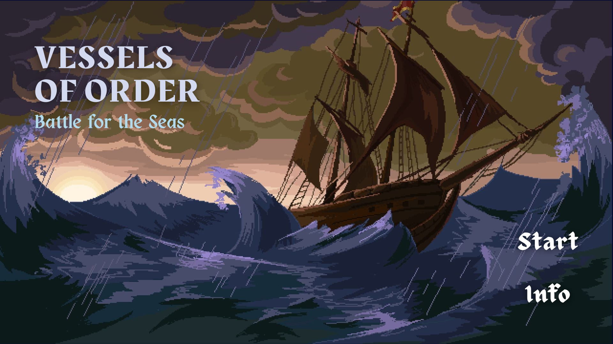

= Vessels of Order: Battle for the Seas
:experimental:
:nofooter:
:source-highlighter: highlightjs
:sectnums:
:stem: latexmath
:toc:
:xrefstyle: short

[[general_description]]
== General description 

A Battleship inspired game in which 6 different ships each implement an algorithm or data structure (Hashset, Red Black Tree, Binary Search, BTree, Splay Tree and Linear Search of a linked list) and face off in classical Battleship manner. Aside from unique ships, other innovations include health and cost for each singular-cell sized ship, upgrades available for each ship, and the option to move a ship. For each of the vessels, their search operation will be key to calculating the damage dealt to an opponent ship, if selected correctly, while the elimination operation will be fundamental to the ship's upgrading.

[[design]]
== Design

See the link:design/readme.adoc[design/] folder for an overall design.

[[user_manual]]
== User manual

[[Window]]
=== Window size
This app was designed for 1080p resulution screens or above. For any lower resolution you may not be able to properly see the game window.

[[build]]
=== Build

*DISCLAIMER*: This program was developed with the Linux operating system and designed to execute in this O.S, which is the reason why it is *heavily encouraged* to run the program in the same O.S.

==== SFML Library
Before compiling the program, make sure you have the SFML library on your device by running the following command:

`pkg-config --modversion sfml-all`

If a library version is not shown in terminal, please run the following command:

`sudo apt install libsfml-dev` for Ubuntu or Debian.

`sudo dnf install SFML SFML-devel` for Fedora

==== FLTK Library
Before compiling the program, make sure you have the FLTK library on your device by running the following command:

`dpkg -l | grep fltk` for Ubuntu or Debian.

`rpm -qa | grep fltk` for Fedora

If nothing is found, please run the following commands:

`sudo apt install libfltk1.3-dev`
& `sudo apt install libpng-dev`
for Ubuntu or Debian.

`sudo dnf install fltk fltk-devel` & `sudo dnf install libpng libpng-devel` for Fedora

==== Compilation
Run the previous commands again to ensure the successful instalation of the libraries. 

To compile the solution, please execute the following commands:

`make`  in the *Vessels/* directory

[[usage]]
=== Usage

To run the program, execute the command `make run`.

[[credits]]
== Credits

Completed by _stack_underflow_, 2025.

- Andrey Bejarano <gerardo.bejaranodiaz@ucr.ac.cr>

- Evan Chen <evan.chen@ucr.ac.cr>

- Albin Monge <albin.monge@ucr.ac.cr>