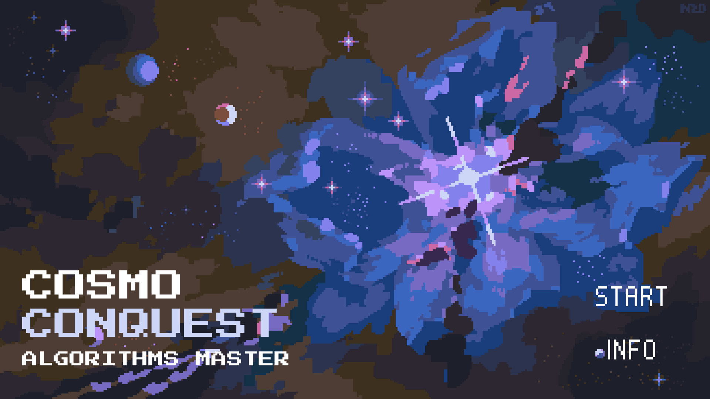
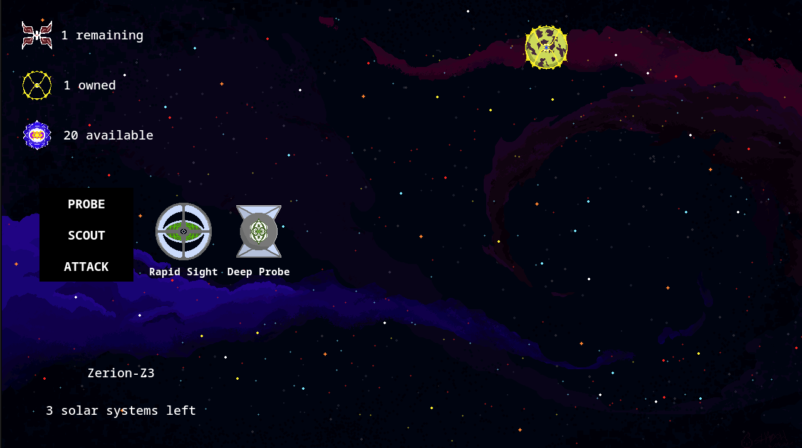
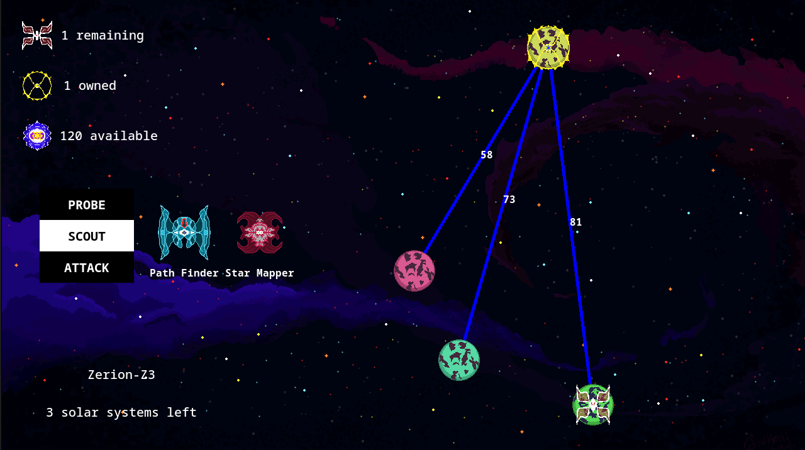
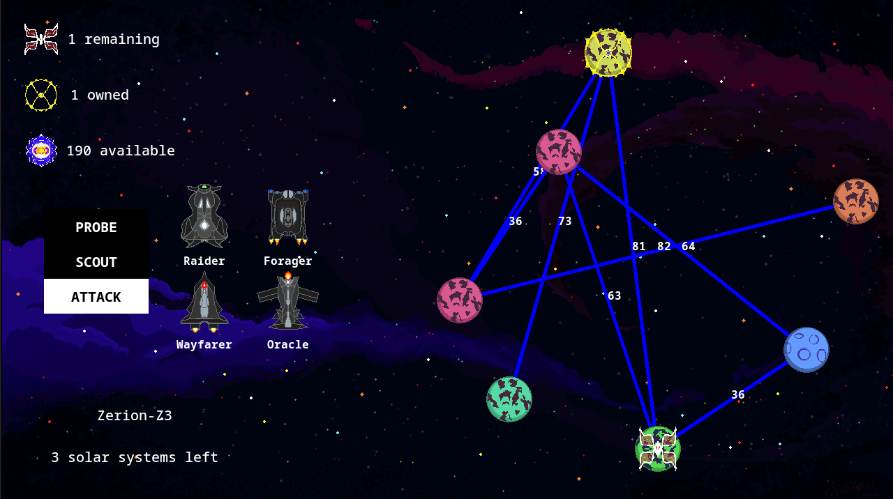

= Space Ops: Algorithms Conquest
:experimental:
:nofooter:
:source-highlighter: highlightjs
:sectnums:
:stem: latexmath
:toc:
:xrefstyle: short

[[description]]
== About the game
Cosmo Conquest is a exploration-based game set in space that requires stategic selection of probing, path-finding, and attack combinations. In each solar system, a player must start from an entry planet with an _Etherium_ mine, established to produce currency in order to activate algorithms-infused spaceships, and venture through each to defeat bosses. The three stages for conquest are explained in the following sections:

=== Stage 1: Probing
Given that only the entry planet is visible upon entering a solar system, spaceships like Rapid Sight (applies BFS) or Deep Probe (applies DFS) to discover new planets and reveal them. <<probe_img>> shows the entry planet and the ships menu at the "probe" section, before any actual planet-exploration is done in the solar system.

[[probe_img]]
.Initial state of solar system, before probing

=== Stage 2: Path-finding
After planets become visible, ships like Path Finder (applies Dijkstra) and Star Mapper (applies Floyd-Warshal) can be activated to gather information of the optimal (shortest) paths between planets. Each connection reveals a number representing the cost of travelling through it. <<pathfind_img>> shows the shortest paths found between the entry planet and the other three probed planets at the moment. After paths are revealed, attacks can be carried out to planets with bosses.

[[pathfind_img]]
.Activation of Path Finder starting from the entry planet.\

=== Stage 3: Attack
Four ships are available for attacking:

1. Raider (applies Greedy search)
2. Forager (applies Local search)
3. WayFarer (applies Exhaustive search)
4. Oracle (applies Pruned Exhaustive search)

Upon activation and selection of a planet with a boss, the ship will traverse the shortest path it finds according to the algorithm it's infused with and attack the enemy with an amount of damage calculated with the cost of travel: the less cost, the more damage applied. Once all bosses have been discovered and defeated in a solar system, the player can move on to the next. This process must be repeated until all solar systems have been completed. 

[[attack_img]]
.Activation of Path Finder starting from the entry planet.\

[[user_manual]]
== User's manual

[[Window]]
=== Window size
This app was designed for 720p resolution screens or above. If your device can't support it, the game window will not be shown properly.

[[build]]
=== Build
Pre-requisites:

- SFML
- FLTK
- make

NOTE: *DISCLAIMER*: This program was developed with the Linux operating system and designed to execute in this O.S, which is the reason why it is *heavily encouraged* to run the program in the same O.S.

==== SFML Library
Before compiling the program, make sure you have the SFML library on your device by running the following command:

`pkg-config --modversion sfml-all`

If a library version is not shown in terminal, please run the following command:

`sudo apt install libsfml-dev` for Ubuntu or Debian.

`sudo dnf install SFML SFML-devel` for Fedora

==== FLTK Library
Before compiling the program, make sure you have the FLTK library on your device by running the following command:

`dpkg -l | grep fltk` for Ubuntu or Debian.

`rpm -qa | grep fltk` for Fedora

If nothing is found, please run the following commands:

`sudo apt install libfltk1.3-dev`
& `sudo apt install libpng-dev`
for Ubuntu or Debian.

`sudo dnf install fltk fltk-devel` & `sudo dnf install libpng libpng-devel` for Fedora

==== Compilation
Run the previous commands again to ensure the successful installation of the libraries. 

To compile the solution, please execute the following command:

`make`  in the *SpaceOps/* directory

[[usage]]
=== Usage

The program can be executed in two modes: game mode, for experiencing the game regularly, and simulation mode, where a simulated game will run automatically and a report will be generated in the `battlelog/` folder. The latter was added to better analyze the performance and effect of each algorithm.

To *run the program in game mode*, execute the command `make run`.

For *simulation mode*, `make simulation` is available for simulating a predefined galaxy conquest.

Alternatively, the user can choose to create their own galaxy file. The specified header must be provided, where the format for each line must follow is detailed: first the solar system's name, then the entry planet and exit planet, and finally the list of planet names. Note that the entry and exit planet's names must also appear in the list, and a maximum of 20 planets has been set for each solar system.

An example of the format is provided below:

====
System,EntryPlanet,ExitPlanet,Planet1,Planet2,Planet3,Planet4,Planet5,Planet6,Planet7,Planet8,Planet9,Planet10,Planet11,Planet12,Planet13,Planet14,Planet15,Planet16,Planet17,Planet18,Planet19,Planet20

Zerion-Z3,Zerion Prime,Zerion 9,Zerion Prime,Zerion 2,Zerion 3,Zerion 4,Zerion 5,Zerion 6,Zerion 7,Zerion 8,Zerion 9

Tiraxis,Tiraxis-1,Tiraxis-7,Tiraxis-1,Tiraxis-2,Tiraxis-3,Tiraxis-4,Tiraxis-5,Tiraxis-6,Tiraxis-7

Myriath,Myriath Alpha,Myriath Epsilon,Myriath Alpha,Myriath Beta,Myriath Gamma,Myriath Delta,Myriath Epsilon

====

NOTE: You can use the `bin/project_02_conquest help` command for an explanation of the arguments needed for simulation mode.

[[credits]]
== Credits

Completed by _stack_underflow_, 2025.

- Andrey Bejarano <gerardo.bejaranodiaz@ucr.ac.cr>

- Evan Chen <evan.chen@ucr.ac.cr>

- Albin Monge <albin.monge@ucr.ac.cr>

Background image credits:

- https://www.google.com/url?sa=i&url=https%3A%2F%2Fx.com%2Fnorma_2d&psig=AOvVaw2-vclC0uBkM2Ew1hs7cGQ_&ust=1753168780729000&source=images&cd=vfe&opi=89978449&ved=0CBEQjRxqFwoTCMiQ25S1zY4DFQAAAAAdAAAAABAU[Start Scene]
- https://www.google.com/url?sa=i&url=https%3A%2F%2Fx.com%2Fnorma_2d&psig=AOvVaw2-vclC0uBkM2Ew1hs7cGQ_&ust=1753168780729000&source=images&cd=vfe&opi=89978449&ved=0CBEQjRxqFwoTCMiQ25S1zY4DFQAAAAAdAAAAABAU[Info Scene]
- https://cdna.artstation.com/p/assets/images/images/047/160/908/original/pxsprite-space.gif?1646911392[Game Scene]
- https://cdn.dribbble.com/userupload/6898070/file/original-3b89ce16b56c7f7f65b17657a9d315f4.gif[GameOver Scene]
